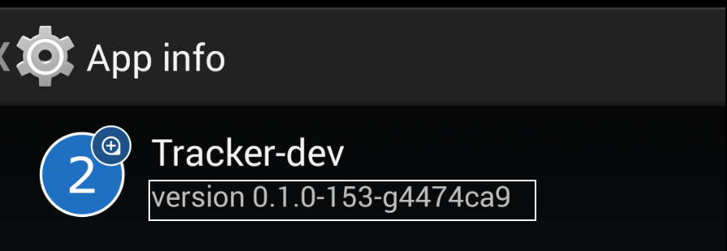

### Your device info

  * Device brand: _______  
  * OS version:   _______
  * SDK version:  _______
  * Google Play Services version: _____
  * App version:  _______

Note: how to get `app version` -> Go to app info and get info like image below

### Steps to reproduce the problem
_____
  
### Step 3: Expected behavior and actual behavior
_____